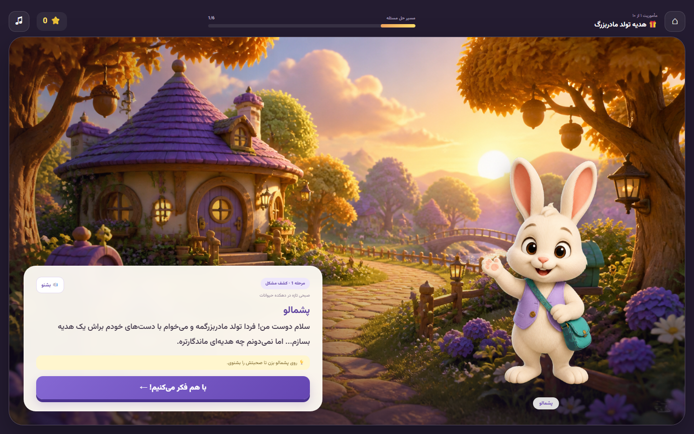

<div dir="rtl" align="right">

# 📖 کتابخانه سحرآمیز

دموی یک موتور بازی داستانی و آموزشی تحت وب برای کودکان ۵ تا ۸ سال.

این پروژه بر اساس مأموریت «هدیه تولد مادربزرگ» ساخته شده و هدف آن نمایش یک ساختار مشترک برای اجرای ۱۰ داستان آموزشی است؛ به‌طوری که داستان‌های بعدی با داده و Assetهای جدید اضافه شوند و نیازی به بازنویسی Engine نباشد.


## تصویر Demo



## امکانات فعلی

- نقشه ۱۰ مأموریت با وضعیت باز و قفل
- یک مأموریت کامل و قابل‌بازی در ۶ مرحله
- تعامل کلیک برای کشف اشیا و سرنخ‌ها
- انتخاب‌های داستانی و نمایش پیامد هر تصمیم
- Drag & Drop برای انتخاب ابزار مناسب
- سؤال تصویری درباره دلیل انتخاب کودک
- امتیازدهی مهارت‌محور، ستاره و نشان
- گزارش ساده رشد کودک برای والدین
- گویندگی آزمایشی فارسی با Web Speech API
- ذخیره خودکار مرحله، انتخاب‌ها و امتیازها در LocalStorage
- امکان ادامه بازی بعد از Refresh و Replay مأموریت
- طراحی Responsive برای موبایل و دسکتاپ
- بارگذاری جداگانه Phaser برای سبک‌ماندن Bundle اولیه

## جریان مأموریت Demo

```text
کشف مشکل
   ↓
انتخاب واکنش
   ↓
کشف و تحلیل سرنخ‌ها
   ↓
انتخاب ابزار با Drag & Drop
   ↓
انتخاب راه‌حل و مشاهده پیامد
   ↓
دلیل انتخاب، بازخورد و جشن
```

داستان Demo درباره «پشمالو»، خرگوش کوچکی است که می‌خواهد برای تولد مادربزرگش بین دسته‌گل و گردنبند بلوط یک هدیه انتخاب کند. کودک ابتدا اطلاعات جمع می‌کند، ابزار مناسب را پیدا می‌کند و سپس پیامد تصمیمش را می‌بیند.

## تکنولوژی‌ها

| بخش | تکنولوژی |
|---|---|
| رابط کاربری | React 19 + TypeScript |
| Game Scene | Phaser.js 3 |
| Build Tool | Vite |
| Styling | CSS خالص و Responsive |
| ذخیره‌سازی | LocalStorage |
| گویندگی Demo | Web Speech API |
| Backend | فعلاً ندارد |

## شروع سریع

پیش‌نیازها:

- Node.js نسخه ۲۰ یا جدیدتر
- npm

نصب و اجرا:

```bash
git clone https://github.com/mahdihz05/kids-web-game.git
cd kids-web-game
npm install
npm run dev
```

سپس آدرس نمایش‌داده‌شده در ترمینال را باز کنید. آدرس پیش‌فرض معمولاً این است:

```text
http://localhost:5173
```

برای ورود مستقیم به مأموریت:

```text
http://localhost:5173/?play=1
```

## دستورات پروژه

```bash
# اجرای محیط توسعه
npm run dev

# بررسی ESLint
npm run lint

# ساخت نسخه Production
npm run build

# اجرای نسخه Build شده
npm run preview
```

## ساختار پروژه

```text
kids-web-game/
├── public/
│   └── assets/
│       ├── characters/       # شخصیت‌های قابل‌تعویض
│       └── scenes/           # پس‌زمینه صحنه‌ها
├── src/
│   ├── components/           # رابط React و تعاملات عمومی
│   ├── data/
│   │   ├── story.json        # محتوای مأموریت Demo
│   │   └── missions.ts       # فهرست ۱۰ مأموریت
│   ├── engine/
│   │   ├── GameEngine.ts
│   │   ├── SceneManager.ts
│   │   ├── DialogueSystem.ts
│   │   ├── ChoiceSystem.ts
│   │   ├── InteractionSystem.ts
│   │   ├── ScoreSystem.ts
│   │   ├── SaveSystem.ts
│   │   ├── ProfileSystem.ts
│   │   └── VoiceSystem.ts
│   ├── game/                 # Phaser Scene و Asset Loader
│   ├── styles/               # طراحی Responsive
│   ├── types/                # قراردادهای Story و Progress
│   ├── App.tsx
│   └── main.tsx
├── package.json
└── vite.config.ts
```

## معماری Engine

Engine از محتوای داستان جدا شده است:

```text
GameEngine
├── SceneManager       مدیریت و اعتبارسنجی Sceneها
├── DialogueSystem     تولید خلاصه و بازخورد داستان
├── ChoiceSystem       ثبت انتخاب‌ها و پیامدها
├── InteractionSystem کشف اشیا و انتخاب ابزار
├── ScoreSystem        امتیاز و ستاره‌ها
├── SaveSystem         ذخیره Progress
├── ProfileSystem      پروفایل و مأموریت‌های کامل‌شده
└── VoiceSystem        گویندگی صحنه‌ها
```

React فقط وضعیت Engine را نمایش می‌دهد و Phaser محیط تصویری هر Scene را بارگذاری می‌کند. متن‌ها، انتخاب‌ها، امتیازها، پیامدها و اتصال Sceneها داخل کامپوننت‌ها نوشته نشده‌اند.

## ساختار یک Scene

نمونه ساده از محتوای داده‌محور:

```json
{
  "id": "gift-decision",
  "type": "choice",
  "phase": 5,
  "phaseTitle": "انتخاب راه‌حل",
  "text": "کدام هدیه را انتخاب می‌کنی؟",
  "image": "craft-workshop",
  "choices": [
    {
      "id": "acorn-necklace",
      "text": "گردنبند بلوط",
      "nextScene": "reasoning",
      "score": 8,
      "skill": "decision",
      "consequence": "این هدیه مدت زیادی باقی می‌ماند."
    }
  ]
}
```

Scene typeهای فعلی:

- `dialogue`: گفت‌وگو و شروع داستان
- `choice`: انتخاب بین راه‌حل‌ها
- `hotspot`: پیدا کردن اشیا در تصویر
- `dragDrop`: انتخاب یا استفاده از ابزار
- `reflection`: انتخاب دلیل و بازاندیشی
- `result`: نتیجه، ستاره‌ها و بازخورد آموزشی

## اضافه‌کردن مأموریت جدید

برای مأموریت دوم نیازی به تغییر کلاس‌های Engine نیست:

1. یک فایل JSON جدید با قرارداد `Story` بسازید.
2. Sceneها و `nextScene` هر انتخاب را مشخص کنید.
3. تصاویر و شخصیت‌های مأموریت را در `public/assets` قرار دهید.
4. کلید تصاویر را به `src/game/assets.ts` اضافه کنید.
5. مأموریت را در Registry یا فهرست مأموریت‌ها ثبت کنید.

هر مأموریت با کلید مستقل زیر در LocalStorage ذخیره می‌شود:

```text
magical-library:progress:<story-id>
```

در نسخه بعدی می‌توان فایل‌های مأموریت را با Dynamic Import یا یک Story Registry بارگذاری کرد تا تمام ۱۰ داستان بدون افزایش Bundle اولیه اجرا شوند.

## تصاویر و شخصیت‌ها

محیط‌های فعلی و شخصیت موقت Demo با هوش مصنوعی تولید شده‌اند. Asset Loader طوری طراحی شده که با دریافت تصاویر نهایی تیم محصول، فایل‌ها بدون تغییر منطق بازی جایگزین شوند.

## نکات مربوط به Voice

گویندگی فعلی برای Demo از صدای موجود در مرورگر استفاده می‌کند. کیفیت و پشتیبانی صدای فارسی به سیستم‌عامل و مرورگر وابسته است. برای نسخه نهایی، فایل صوتی هر Scene می‌تواند در داده داستان تعریف و از Asset Loader پخش شود.

## ذخیره‌سازی و حریم خصوصی

این Demo Backend ندارد و اطلاعات فقط داخل مرورگر کاربر ذخیره می‌شوند. پاک‌کردن داده‌های سایت یا LocalStorage باعث حذف پیشرفت بازی خواهد شد.

## وضعیت پروژه

این ریپازیتوری یک Demo/MVP برای ارزیابی ساختار فنی و تجربه مأموریت اول است. مواردی مانند Backend، CMS، احراز هویت واقعی والد، Voice حرفه‌ای و محتوای ۹ مأموریت دیگر هنوز بخشی از Demo فعلی نیستند.

</div>
