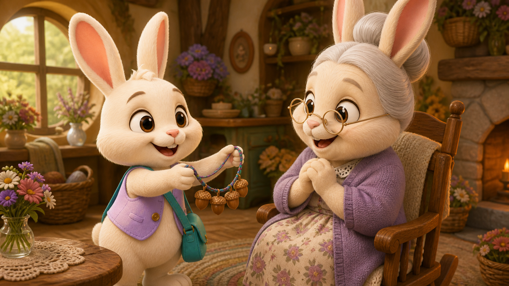

<div dir="rtl" align="right">

# 📚 کتابفروشی سحرآمیز متفکر

بازی داستانی و آموزشی فارسی برای کودکان ۵ تا ۸ سال؛ کودک با کمک «کوکی متفکر» کتاب‌ها را بیدار می‌کند و در مأموریت اول به «پشمالو» کمک می‌کند برای تولد مادربزرگ هدیه‌ای ماندگار انتخاب و آماده کند.




## وضعیت نسخه

این مخزن شامل نسخهٔ نهایی و قابل‌انتشار مأموریت اول است:

- مقدمه برند و معرفی کوکی متفکر
- قفسه ۱۰ کتاب با یک مأموریت فعال و ۹ مأموریت قفل
- یک داستان کامل ۱۵ صحنه‌ای در ۶ مرحله آموزشی
- دو مسیر «گردنبند» و «گل»؛ مسیر گل پیامد و امکان اصلاح تصمیم دارد
- نتیجه، نشان «فکرکننده‌ی خوب»، پنج شاخص مهارتی و گزارش والدین

تولید محتوای ۹ مأموریت بعدی، Backend و حساب کاربری در محدوده این نسخه نیستند.

## امکانات اصلی

- رابط کاملاً فارسی، RTL و Responsive برای موبایل، تبلت و دسکتاپ
- تشخیص مشکل، شناخت احساس، مقایسه پیامدها و انتخاب دلیل
- کشف سرنخ‌های تصویری در باغ
- انتخاب چند ابزار صحیح: بلوط، نخ و صبر
- مینی‌تعامل ساخت گردنبند
- شاخه انتخاب گل، واکنش باغبان و بازگشت بدون بن‌بست
- انتخاب اولیهٔ گل مستقیماً باغبان را نشان می‌دهد و سؤال دلیل فقط مسیر گردنبند را همراهی می‌کند
- سؤال خلاف‌واقع و فعالیت «دو ستاره و یک آرزو»
- ذخیره خودکار صحنه، انتخاب‌ها، ابزارها، ساخت، امتیاز و بازاندیشی در LocalStorage
- ادامه بازی پس از Refresh و Replay بدون دوبرابرشدن ستاره‌ها
- دکمهٔ «بشنو» با پشتیبانی از فایل صوتی محلی و گویش فارسی مرورگر به‌عنوان حالت جایگزین
- محافظ نگه‌داشتنی برای ورود به گزارش والدین
- مجموعه تصاویر اختصاصی PNG/WebP بدون fallback یا تکرار میان گزینه‌های یک صفحه
- نمایش کامل تصاویر بدون کشیدگی یا برش مخرب در دسکتاپ، تبلت و موبایل
- ورق‌خوردن ۸۵۰ میلی‌ثانیه‌ای مبتنی بر `animationend` با قفل ورودی
- حالت Reduced Motion با Fade کوتاه

## جریان آموزشی مأموریت اول

```text
کشف مشکل و تولد مادربزرگ
          ↓
شناخت احساس پشمالو
          ↓
کشف گل و بلوط در باغ
          ↓
مقایسه هدیه‌ها و دلیل انتخاب
          ↓
انتخاب نهایی هدیه
       ↙             ↘
  انتخاب گل        انتخاب گردنبند
پیامد باغبان       انتخاب ابزار
اصلاح تصمیم            ↓
بازگشت به انتخاب    ساخت هدیه
       ↘             ↙
       دریافت هدیه توسط مادربزرگ
                    ↓
   سؤال پایانی + دو ستاره و یک آرزو
                    ↓
             نشان و گزارش رشد
```

## تکنولوژی و معماری

| بخش | پیاده‌سازی |
|---|---|
| رابط | React 19 + TypeScript |
| Build | Vite 8 |
| Story Engine | موتور داده‌محور اختصاصی |
| Styling | CSS خالص، RTL و Responsive |
| ذخیره | LocalStorage با بازیابی و مهاجرت داده قدیمی |
| تصویر | PNG/WebP اختصاصی، Manifest مرکزی و Preload صحنه |
| Backend | ندارد |

منطق بازی از محتوای داستان جداست. صحنه‌ها، انتخاب‌ها، امتیازها، پیامدها و اتصال مسیرها در `src/data/story.json` تعریف می‌شوند و React فقط Snapshot موتور را نمایش می‌دهد.

```text
GameEngine
├── SceneManager        مدیریت صحنه و مسیر
├── ChoiceSystem        ثبت انتخاب، تلاش مجدد و پیامد
├── InteractionSystem   سرنخ‌ها و ابزارهای چندگانه
├── ScoreSystem         امتیاز و ستاره
├── SaveSystem          ذخیره و بازیابی پیشرفت
└── ProfileSystem       پروفایل، نتیجه و گزارش رشد
```

## ساختار پروژه

```text
kids-web-game/
├── .github/workflows/ci.yml
├── deploy/                    # راهنمای Nginx و Rollback
├── public/assets/
│   ├── brand/                 # نشان، کوکی، دوستان و چوب جادویی
│   ├── characters/            # شخصیت‌های شفاف رابط
│   ├── choices/               # تصاویر مستقل گزینه‌ها و بازاندیشی
│   ├── fonts/                 # فونت فارسی محلی
│   ├── scenes/                # تصاویر اولیه صحنه‌ها
│   ├── scenes-v3/             # صحنه‌های نهایی با هویت ثابت پشمالو
│   └── tools/                 # ابزارهای مستقل و بلوط ساخت
├── scripts/
│   ├── test-story.mjs         # تست گراف و دو شاخه داستان
│   ├── validate-v1.mjs        # اعتبارسنج قرارداد و Assetها
│   └── visual-audit.mjs       # ثبت نماهای Responsive
├── src/
│   ├── components/
│   ├── data/story.json
│   ├── engine/
│   ├── game/assets.ts
│   ├── styles/global.css
│   └── types/story.ts
└── package.json
```

## اجرای محلی

پیش‌نیاز: Node.js ۲۰ یا جدیدتر و npm.

```bash
git clone https://github.com/mahdihz05/kids-web-game.git
cd kids-web-game
npm ci
npm run dev
```

آدرس‌های کاربردی:

- صفحه اصلی: `http://localhost:5173/`
- ورود مستقیم به قفسه: `http://localhost:5173/?library=1`
- ورود مستقیم به مأموریت: `http://localhost:5173/?play=1`

## کنترل کیفیت

```bash
# تست گراف داستان و هر دو مسیر
npm test

# قرارداد رسپانسیو تصاویر در پنج اندازه
npm run test:responsive

# اعتبارسنج قرارداد، صحنه‌ها و Assetها
npm run validate:v1

# کنترل TypeScript/ESLint
npm run lint

# ساخت Production
npm run build

# اجرای Build نهایی
npm run preview

# اجرای همه کنترل‌ها
npm run check
```

تست داستان موارد زیر را پوشش می‌دهد:

- دسترسی‌پذیری هر ۱۵ صحنه
- معتبر بودن تمام مقصدهای `nextScene`
- پایان موفق هر دو شاخه گل و گردنبند
- رفتن مستقیم انتخاب گل به صحنهٔ باغبان، بدون نمایش سؤال دلیل
- باقی‌ماندن پاسخ‌های Retry در همان صحنه
- عبور مسیر گل از پیامد و اصلاح تصمیم
- الزام هم‌زمان سه ابزار صحیح
- وجود سه پاسخ «دو ستاره و یک آرزو»
- محاسبهٔ صحیح سرنخ‌ها در پنج نمای دسکتاپ، تبلت عمودی/افقی و موبایل عمودی/افقی
- یکتا بودن تصاویر گزینه‌ها و ابزارها، وجود فایل‌ها و نبود fallback

## تصاویر و طراحی Responsive

تمام تصاویر داستان از Manifest مرکزی `src/game/assets.ts` خوانده می‌شوند. تصویر اصلی هر صحنه داخل یک قاب انعطاف‌پذیر با `object-fit: contain` نمایش داده می‌شود؛ در نتیجه کل تصویر در هر نسبت صفحه قابل مشاهده است و فضای اضافه با پس‌زمینهٔ محو همان صحنه پر می‌شود.

| نما | رفتار تصاویر و کنترل‌ها |
|---|---|
| دسکتاپ، از ۱۲۰۰px | تصویر ۶۰٪ و پنل ۴۰٪ در دو ستون مستقل |
| تبلت افقی، ۷۶۸ تا ۱۱۹۹px | تصویر ۵۶٪ و پنل ۴۴٪ در دو ستون مستقل |
| تبلت عمودی، ۷۶۸ تا ۱۱۹۹px | تصویر ۴۴٪ بالا و پنل ۵۶٪ پایین |
| موبایل عمودی، تا ۷۶۷px | تصویر ۴۰٪ بالا و پنل ۶۰٪ پایین، گزینه‌های بدون اسکرول |
| موبایل افقی کوتاه | تصویر ۴۲٪ و پنل ۵۸٪ کنار هم، بدون هم‌پوشانی |

قواعد اصلی تصاویر:

- هیچ تصویر داستانی کشیده نمی‌شود و نسبت اصلی خود را حفظ می‌کند.
- تصویر صحنه و پنل کنترل در هیچ‌یک از پنج نمای هدف روی هم قرار نمی‌گیرند.
- تصاویر گزینه‌ها و بازاندیشی با `object-fit: contain` کامل دیده می‌شوند.
- ابزارها و بلوط‌های ساخت روی زمینهٔ شفاف و در قاب مربعی قرار می‌گیرند.
- سرنخ‌های گل و بلوط بر اساس محدودهٔ واقعی تصویر `contain` موقعیت‌گذاری می‌شوند.
- هیچ کامپوننتی برای تصاویر `width` یا `height` ثابت HTML ندارد.

## داده و ذخیره‌سازی

هیچ اطلاعاتی به سرور ارسال نمی‌شود. پیشرفت مأموریت در مرورگر و با کلید زیر ذخیره می‌شود:

```text
magical-library:progress:grandmas-birthday-gift
```

وضعیت مشاهده مقدمه نیز در LocalStorage نگهداری می‌شود. پاک‌کردن داده‌های سایت، پیشرفت محلی را حذف می‌کند.

## استقرار Production

```bash
npm ci
npm run check
```

خروجی قابل انتشار در پوشه `dist/` ساخته می‌شود. نمونه Nginx و روش انتشار نسخه‌ای/rollback در [`deploy/README.md`](deploy/README.md) قرار دارد. انتشار پیشنهادی ابتدا در `dist-next` انجام می‌شود و فقط بعد از smoke test جایگزین `dist` خواهد شد. سرور باید برای SPA تمام مسیرهای ناشناخته را به `index.html` برگرداند و Assetهای hash‌شده را با Cache بلندمدت سرو کند.

## دسترس‌پذیری

- نواحی لمس مناسب کودک
- Focus قابل مشاهده برای صفحه‌کلید
- `aria-label` و `aria-live` برای کنترل‌ها و بازخوردها
- قفل ورودی هنگام Transition
- پشتیبانی از `prefers-reduced-motion`
- Safe Area موبایل و چیدمان فشرده مسیر شش‌مرحله‌ای

## مالکیت و استفاده از Assetها

شخصیت‌ها، لوگو، نام‌ها، داستان و سایر دارایی‌های برند «متفکر» متعلق به کارفرما هستند. وجود فایل‌ها در این مخزن به معنی اجازه استفاده مجدد، فروش، آموزش مدل یا استفاده در پروژه دیگر نیست. توضیحات کامل در [`BRAND-ASSETS.md`](BRAND-ASSETS.md) آمده است.

## توسعه مأموریت‌های بعدی

برای افزودن مأموریت جدید:

1. یک Story Package مطابق قرارداد `src/types/story.ts` بسازید.
2. صحنه‌ها و مسیرهای بدون بن‌بست را تعریف کنید.
3. تصاویر بهینه را در `public/assets/scenes` قرار دهید.
4. کلید تصاویر را در `src/game/assets.ts` ثبت کنید.
5. مأموریت را به Registry قفسه اضافه کنید.
6. تست گراف داستان و هر دو شاخه را بنویسید.

</div>
